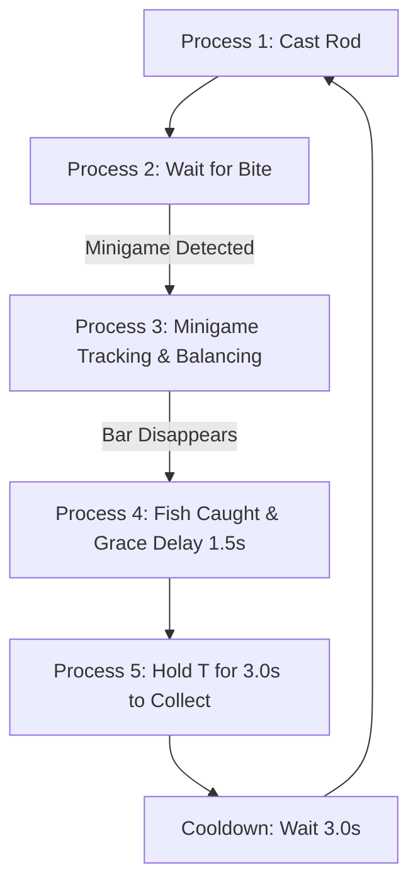

# EasySlayer

> **High-Performance Autonomous Computer Vision Fishing Automation Suite**  
> Engineered with Python, OpenCV, Win32 SendInput, and a Sleek Floating Desktop HUD.

---

## Overview

**EasySlayer** is a state-of-the-art automated fishing suite designed for games featuring dynamic vertical-bar fishing minigames (such as Roblox fishing experiences and similar titles). Powered by a dual-engine Computer Vision pipeline and hardware-level Windows input emulation, EasySlayer achieves pixel-perfect tracking, sub-millisecond reaction times, and zero CPU bottlenecks.

---

## Key Highlights & Architecture

### 1. Dual-Engine Computer Vision Pipeline
* **High-Accuracy Normalized Cross-Correlation (NCC):** Uses a pre-extracted reference template (`white_slider_template.png`, 26x29 px) to lock onto the player's white slider with 99.9% accuracy. Enforces a strict confidence threshold ($\ge 0.80$) to eliminate false positives caused by water reflections, sunlight, and dock textures.
* **Universal Chromatic Glow Detection:** Tracks the target capture zone across shifting colors (**Green, Yellow, Orange, Red, Blue, Purple**) by analyzing high-luminance saturation fields in the HSV color space (`Value >= 120`, `Saturation >= 65`).
* **Multi-Frame Tracking Persistence:** Maintains a 12-frame memory buffer (~0.2s) to prevent tracking dropouts during rapid in-game hue and lighting transitions.

### 2. Precision Hybrid Physics & Control Engine
* **Ascent Dynamics (`HOLD (CLIMB)`):** When the white slider is below the target zone, the controller initiates a continuous hardware left-mouse hold to drive the slider upward against in-game gravity.
* **Descent Dynamics (`RELEASE (DROP)`):** When the slider is above the target zone, the controller releases the mouse completely, allowing gravity to pull the slider back down smoothly.
* **Strict Inside-Box Micro-Tapping (`TAP (INSIDE BOX)`):** Rhythmic clicking is permitted **strictly** when the slider is located inside the target zone boundaries. Applies non-blocking time-based pulses (50ms–75ms) to stabilize the slider near the center without overshooting.

### 3. Hardware-Level Windows Input Emulation
* **Direct Win32 `SendInput` API:** Utilizes low-level Windows hardware scan codes (`0x14` for `T`, `MOUSEEVENTF_LEFTDOWN` / `MOUSEEVENTF_LEFTUP`) for instant execution, bypassing driver latency.
* **Typematic Key-Repeat Engine:** Simulates continuous hardware key pulses (50ms repeat interval) over the full 3.0s holding duration. This prevents Roblox and anti-macro interaction prompts from resetting midway.

### 4. Sleek Floating Modern HUD
* **Borderless & Translucent:** Designed with an ultra-clean glassmorphic dark theme (`Always On Top`, draggable, 94% opacity).
* **Live Video Preview:** Real-time mini viewport (30–60 FPS) rendering live bounding boxes, player coordinates, and current input telemetry.
* **Session Telemetry:** Tracks elapsed runtime (`00:00:00`) and total fish caught.
* **Zero-Freeze Threading Architecture:** Global hotkeys run on a dedicated native listener while safely marshaling events to the main Tkinter thread via asynchronous dispatch.

---

## 5-Stage Automation Pipeline



1. **Process 1: Cast Rod**
   * Dispatches a single left-click to cast the fishing line into the water, followed by an initial stabilization delay.
2. **Process 2: Wait for Bite**
   * Continuously scans the user-defined Region of Interest (ROI) at 60 FPS for the appearance of the fishing bar.
3. **Process 3: Precision Minigame Balancing**
   * Real-time calculation of player marker $Y$ and target box bounds $[Y_{top}, Y_{bottom}]$.
   * Automatically executes continuous hold, full release, or synchronized inside-box rhythmic taps.
4. **Process 4: Catch Confirmation & Post-Catch Grace Delay**
   * Once the minigame bar disappears, the fish is hooked.
   * The controller waits **1.0–2.0 seconds (default: 1.5s)** for the catch prompt and animation to complete.
5. **Process 5: Fish Collection & Cycle Cooldown**
   * Holds the interaction key (`T`) for **3.0 seconds** using typematic pulses to store the fish.
   * Waits a configurable **3.0-second cooldown** before recasting to begin the next cycle.

---

## Global Hotkeys

All hotkeys operate globally across Windows, even when EasySlayer is running in the background:

| Hotkey | Action | Description |
| :---: | :---: | :--- |
| **`F6`** | **Start / Stop** | Toggle automated fishing on or off instantly |
| **`F7`** | **Select ROI** | Launch the translucent fullscreen snipping tool to select the in-game bar |
| **`F8`** | **Emergency Stop** | Immediately release all keys, unhook mouse, and halt automation |

---

## Installation & Quickstart

### Prerequisites
* Windows 10 or Windows 11 (64-bit)
* Python 3.10, 3.11, or 3.12

### Step 1: Install Dependencies
Open PowerShell or Command Prompt in the project folder and run:
```bash
pip install -r requirements.txt
```
*Or install the required packages directly:*
```bash
pip install mss opencv-python numpy pyautogui pynput pillow
```

### Step 2: Launch EasySlayer
* **Option A:** Double-click **`run.bat`**
* **Option B:** Run via terminal:
```bash
py main.py
```

### Step 3: Configure Region of Interest (ROI)
1. Position your in-game camera facing the water.
2. Press **`F7`** (or click **`Area [F7]`** on the HUD).
3. Click and drag a rectangle enclosing the vertical minigame bar on your screen.
4. Press **`F6`** (or click **`Start [F6]`**) to begin automated fishing.

---

## Configuration Reference

Settings are stored in `fishing_config.json` and can be adjusted live through the **`Settings`** panel:

| Setting Key | Default | Description |
| :--- | :---: | :--- |
| `deadzone_px` | `5` | Margin of error around target center before triggering adjustment |
| `post_catch_delay` | `1.5` | Delay in seconds between catch confirmation and holding `T` |
| `hold_t_duration` | `3.0` | Holding duration in seconds for the collection key |
| `delay_before_recast` | `3.0` | Cooldown period in seconds before starting the next cast |
| `target_min_val` | `120` | Minimum HSV Value (Brightness) for target glow detection |
| `target_min_sat` | `65` | Minimum HSV Saturation for chromatic hue isolation |
| `bite_timeout` | `60.0` | Maximum wait duration before recasting if no bite occurs |

---

## Project Structure

```
EasySlayer/
├── config.py                 # Configuration loader and default schema
├── controller.py             # 5-stage state machine & automation loop
├── detector.py               # Dual-engine Computer Vision detection
├── gui.py                    # Floating glassmorphic desktop HUD
├── input_manager.py          # Direct Win32 SendInput hardware emulation
├── overlay.py                # Click-through transparent HUD border
├── snipping_tool.py          # Fullscreen drag-selection ROI tool
├── white_slider_template.png # Reference template for NCC matching
├── test_detection.py         # Test harness for detector calibration
├── main.py                   # Application entry point
├── run.bat                   # Windows batch launcher
└── README.md                 # Complete documentation
```

---

## License & Disclaimer

This software is developed strictly for educational and automation research purposes. Use responsibly in accordance with the terms of service of the games and platforms you interact with.

Licensed under the [MIT License](LICENSE).
